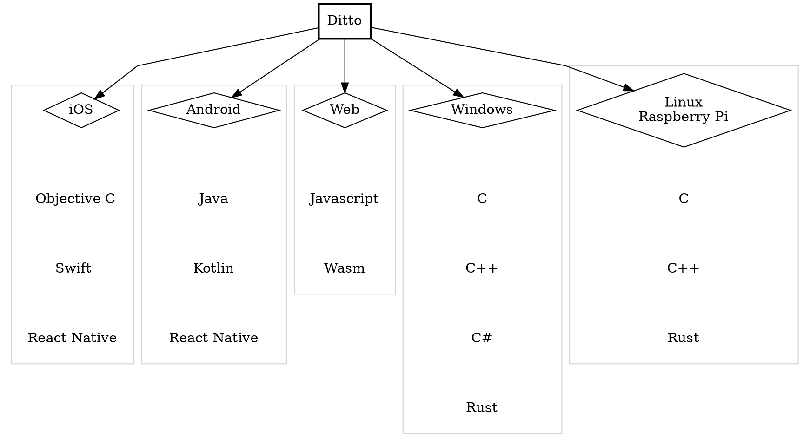

```dot process
digraph {
    edge [
        // style = dotted
    ]
    node [
        shape = none
    ]
    splines = polyline
    ditto -> ios
    ditto -> android
    ditto -> web
    ditto -> windows
    ditto -> linux

    ditto [
        label = "Ditto"
        shape = box
        style = bold
    ]
    obj_c [label = "Objective C"]
    swift [label = "Swift"]
    java [label = "Java"]
    kotlin [label = "Kotlin"]
    c_windows [label = "C"]; c_linux [label = "C"]
    cpp_windows [label = "C++"]; cpp_linux [label = "C++"]
    rust_windows [label = "Rust"]; rust_linux [label = "Rust"]
    csharp [label = "C#"]
    javascript [label = "Javascript"]
    react_native_ios [label = "React Native"]
    react_native_android [label = "React Native"]
    subgraph cluster_ios {
        label = "";
        color = lightgrey
        edge [style = invis]
        ios [
            label = "iOS"
            shape = diamond
        ];
        ios -> obj_c -> swift -> react_native_ios
    }
    subgraph cluster_android {
        label = "";
        color = lightgrey
        edge [style = invis]
        android [
            label = "Android"
            shape = diamond
        ];
        android -> java -> kotlin -> react_native_android
    }
    subgraph cluster_windows {
        label = "";
        color = lightgrey
        edge [style = invis]
        windows [
            label = "Windows"
            shape = diamond
        ];
        windows -> c_windows -> cpp_windows -> csharp -> rust_windows
    }
    subgraph cluster_linux {
        label = "";
        color = lightgrey
        edge [style = invis]
        linux [
            label = "Linux\nRaspberry Pi"
            shape = diamond
        ];
        linux -> c_linux -> cpp_linux -> rust_linux
    }
    subgraph cluster_web {
        label = "";
        color = lightgrey
        edge [style = invis]
        web [
            label = "Web"
            shape = diamond
        ];
        web -> javascript -> Wasm
    }
}
```
